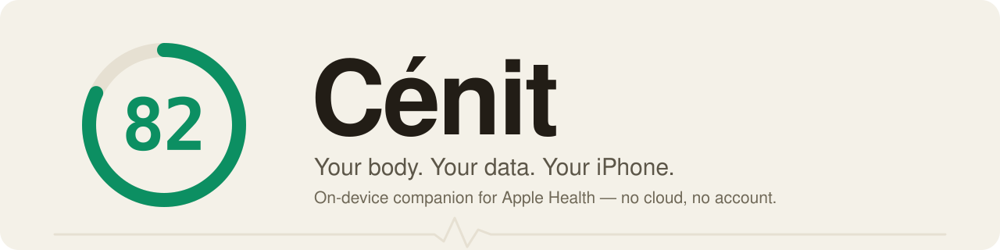

<p align="center">
  
</p>

<h1 align="center">Cénit</h1>

<p align="center"><b>Your body. Your data. Your machine. Local-first, no cloud.</b></p>

<p align="center">
  
  
  
  
  <a href="LICENSE"></a>
</p>

<p align="center">
  <a href="#features">Features</a> ·
  <a href="docs/ARCHITECTURE.md">Architecture</a> ·
  <a href="#privacy">Privacy</a> ·
  <a href="#build">Build</a>
</p>

---

Cénit is a standalone, fully **on-device** health app built on **Apple Health** and
your **Apple Watch**. It syncs HealthKit samples into a local SQLite database on
your iPhone and computes preparedness, strain, HRV, and sleep **locally**, with
no account and no cloud. There is no separate wearable to pair — Cénit reads the
samples your Apple Watch already saves to Apple Health.

> **Cénit is not a medical device.** Every derived metric is an approximation,
> not clinical data. See [`DISCLAIMER.md`](DISCLAIMER.md).

Cénit is free to use today; the author may introduce paid features later. This
does not change the source license below.

---

## Contents

- [Why Cénit](#why-cénit)
- [Features](#features)
- [Architecture](#architecture)
- [Build](#build)
- [Privacy](#privacy)
- [Attribution](#attribution)
- [Disclaimer](#disclaimer)
- [License](#license)
- [Docs](#docs)

---

## Why Cénit

Your biometrics are yours. Cénit is built on that premise:

- **Own your data.** Cénit reads from **Apple Health** (and optional file imports)
  and writes everything to a local SQLite database on your iPhone. Nothing is
  uploaded unless you opt into backup or exercise media.
- **Account-free and on-device.** Cénit never creates an account and never phones
  home. Health data stays in the app sandbox.
- **Bring your history.** Already have years of data in Apple Health? Sync it
  once and it's permanently on your machine. You can also import an Apple Health
  `export.xml` from **Ajustes → Fuentes de datos**.
- **Transparent math.** Strain, HRV, sleep, and the daily preparedness verdict
  are recomputed on-device from documented, citable methods (Task Force 1996 HRV,
  Karvonen %HRR, Edwards / Banister TRIMP, Tanaka HRmax, and so on) — every
  analyzer file documents exactly what it does.

---

## Features

The live shell is **four tabs**:

| Tab | What's there |
|---|---|
| **Hoy** | Home. A daily preparedness verdict, then a grid of signal tiles: sleep, HRV, resting heart rate, day strain, steps, skin temperature, respiration, and stress. Pull down to sync Apple Health. |
| **Tendencias** | Longer-range body. Period chips (week / month / 3 months / 6 months / year / all). Modules for rest & load, training load (ACWR), vitals, activity, and longevity (fitness age, VO₂max). |
| **Entrenar** | A training planner and guided strength-session logger: routines, sets/reps tracking, rest timers, and an optional **Apple Watch** companion that mirrors the session and logs sets independently from the wrist. |
| **Ajustes** | Profile (age / sex / weight / height / HRmax), units, data sources & backup, recovery recalibration, opt-in exercise media downloads, illness watch, reminders, and About. |

There is also a first-run **onboarding wizard** and Home-screen / Lock-screen
**widgets**.

See [`docs/FEATURES.md`](docs/FEATURES.md) for the full feature guide.

---

## Architecture

The repository is split into platform-pure Swift packages plus the iOS app target
(`Cenit`). Every package targets both iOS and macOS so the pure logic builds and
tests without an app; framework-specific code is guarded with
`#if canImport(UIKit)` / `#if canImport(AppKit)`.

```
Cenit/                 SwiftUI app layer — AppModel, Repository, Screens
CenitApp/              iOS app shell — HealthKitBridge, RootTabView, widgets, intents
CenitWatch/            watchOS companion (strength-session logging + HR mirroring)
CenitWidgets/          WidgetKit extension (Home / Lock-screen widget)
CenitShared/           code shared between the app and the widgets
Packages/
  BiometricStreams/     neutral vocabulary of biometric rows (pure, zero deps)
  CenitStore/           GRDB/SQLite persistence (versioned migrations)
  CenitAnalytics/      HRV / preparedness / strain / sleep math (pure, DB-free)
  CenitTraining/       strength domain (catalog, sets/reps, routines)
  CenitImport/         Apple Health importers
  CenitDesign/          SwiftUI design system
  CenitModels/         shared models
Tools/                  developer scripts (localization, screen captures, design lint)
```

See [`docs/ARCHITECTURE.md`](docs/ARCHITECTURE.md) for the full system map —
pipeline, package boundaries, concurrency model, and storage schema.

---

## Build

Cénit builds from source. Requirements: a recent Xcode and an iPhone on
**iOS 17+**. To explore without a full HealthKit history, import an Apple
Health export instead.

```bash
git clone https://github.com/blandisc/cenit.git
cd cenit
git checkout iOS

brew install xcodegen   # if you don't have it
xcodegen generate       # generates Cenit.xcodeproj from project.yml
```

Then open the project in Xcode, select the `Cenit` scheme, and run on your
iPhone. See [`docs/BUILD.md`](docs/BUILD.md) for the full build guide, including
signing and installing on-device without a paid Apple Developer account.
Cénit is prepared for App Store distribution; in the meantime, building from
source is how you run it.

To explore without an Xcode project, the packages build on their own:

```bash
cd Packages/CenitAnalytics && swift build && swift test
```

---

## Privacy

**On-device by design.** Cénit has no server, no telemetry, and no account. Your
Health data, imports, and computed metrics live in a local SQLite database on your
device.

Network exceptions, both **off unless you opt in**:

- **iCloud Drive backup** of the local database.
- **Exercise media downloads** in Ajustes: fetches exercise thumbnails and short
  video loops and caches them on your iPhone. Turning it off stops future
  downloads; a separate control clears what's already stored.
- **AI Coach** (off by default): only with an API key you supply yourself, to
  the provider you choose.

Read the full privacy policy at
**[blandisc.github.io/cenit/privacidad.html](https://blandisc.github.io/cenit/privacidad.html)**,
or see [`docs/PRIVACY_SECURITY.md`](docs/PRIVACY_SECURITY.md) for the technical
detail of exactly what stays on-device.

---

## Attribution

With thanks to the open-source projects Cénit builds on — GRDB.swift,
ZIPFoundation, Space Grotesk, and free-exercise-db. Full detail in
[`ATTRIBUTION.md`](ATTRIBUTION.md) and [`NOTICE`](NOTICE).

---

## Disclaimer

**Cénit is not a medical device.** Heart rate, HRV, preparedness, strain, sleep
stages, SpO₂, respiratory rate, and skin temperature are **approximations**
computed from published methods. They are not clinically validated and are not
medical advice. Do not use them to diagnose, treat, or make health decisions —
consult a qualified professional.

Provided **as-is**, with **no warranty**. You use it at your own risk. Read the
full notice in [`DISCLAIMER.md`](DISCLAIMER.md).

---

## License

Cénit is **source-available** under the [PolyForm Noncommercial License 1.0.0](LICENSE):
**free for personal and other non-commercial use** — read it, run it, fork it, and
contribute. Commercial use of the source is not granted by this license. (PolyForm
Noncommercial is a proper software license with patent terms; it is deliberately
*not* an OSI "open-source" licence, because that would permit the commercial use
this license rules out.)

The license covers Cénit's own original code and docs; bundled dependencies keep
their own licenses (see [`NOTICE`](NOTICE)). By opening a pull request you agree
your contribution is licensed under the same terms — see
[`docs/CONTRIBUTING.md`](docs/CONTRIBUTING.md).

---

## Docs

- [`docs/BUILD.md`](docs/BUILD.md) — full build & install guide.
- [`docs/FEATURES.md`](docs/FEATURES.md) — the full feature guide.
- [`docs/ARCHITECTURE.md`](docs/ARCHITECTURE.md) — the system map (pipeline, package boundaries, storage schema).
- [`docs/PRIVACY_SECURITY.md`](docs/PRIVACY_SECURITY.md) — exactly what stays on-device.
- [`docs/CONTRIBUTING.md`](docs/CONTRIBUTING.md) — repository layout, build/test, design-system rules.
- [`CHANGELOG.md`](CHANGELOG.md) — release history and what to expect.
- [`DISCLAIMER.md`](DISCLAIMER.md) · [`ATTRIBUTION.md`](ATTRIBUTION.md) — trademark/medical notice and full credits.
